# My Game Development Portfolio

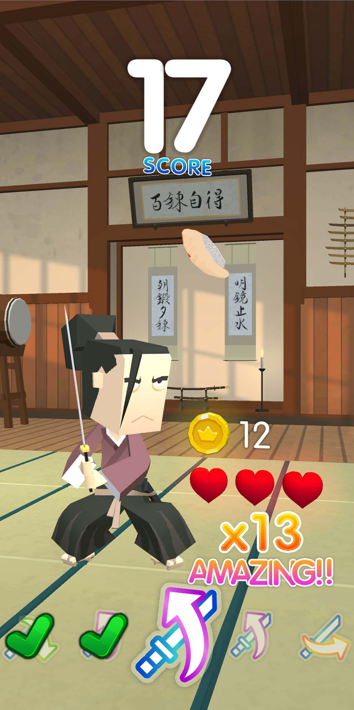  
**SUSHIDO**
-	Unity/C#
-	A high quality casual mobile game in development
-	Engineered the game with existing models
- Utilizes players' gestures for controls
- QTE & Combo system
-	Designed & Implemented the UI with fluid animations
- Optimized performance, runs well on low-tier phones
  

  
**Wangan Racing Demo Video Demonstration** (Click snapshot to play the video)
-	Unity/C#
-	An arcade racing project
-	Engineered the game with existing models
-	Designed & Implemented the UI system
-	Fine-tuned graphics and fluid gameplay  

  
**1vs100000000 Demo Video Demonstration** (Click snapshot to play the video)
-	Unity/C#
-	An arcade zombie shooter in development
-	Engineered the game with existing models
-	Level design with existing models
-	Expandable weapon & enemy system 
-	Expandable perk & pickup system
-	Supply airdrop system
-	Optimized gameplay and audio system
-	Designed & implemented the UI system
-	Fine-tuned graphics  

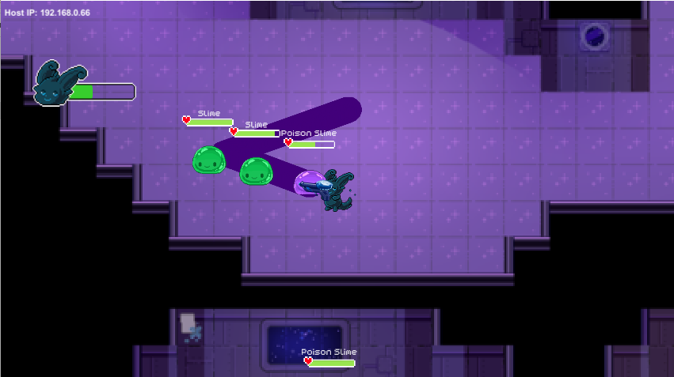
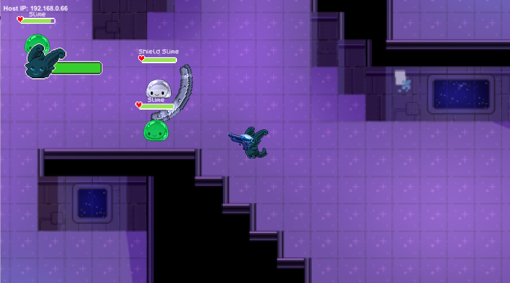  
**Slime Universe**
- Unity/C#
- A multiplayer top-down shooter utilizing UNET
- A school project made in a 6 people team, I'm the programmer of the enemies
- Programmed the behaviors of 4 types of slimes 
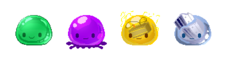 
  - normal slime (has a dash action)
  - poison slime (leaves a poison trail behind)
  - electric slime (stuns player)
  - shield slime (blocks projectiles)
    

  
**Roguelite Shooter Demo Video Demonstration** (Click snapshot to play the video)
- Game Maker Studio 2/GML
- A risk of rain style game in top down perspective
- Engineered a fully-featured expandable and modifiable game system
  - Projectiles
  - Perks & Items
  - Abilities
  - Enemies
  - Status (Buff & Debuff)
  - UI System
- Optimized CPU & memory usage
- Designed & implemented the UI
- MMO-style message system
- Customizable damage number system referenced from Maple Story
  

  
**ultraviolet Demo Video Demonstration** (Click snapshot to play the video)
- RPG Maker MV/JavaScript
- A pixel & cyberpunk short top-down shooter game
- A school project made in a 6-people team, I am the main programmer and level designer
- One of the only shooter games made in RPG Maker
- Scripted the gameplay, character abilities, weapon system, and enemy system
- Designed & implemented the UI

  
## Mini Games
**A.VOID** 
https://jiayuewu.itch.io/avoid 
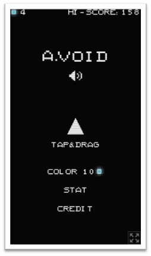 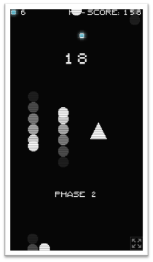 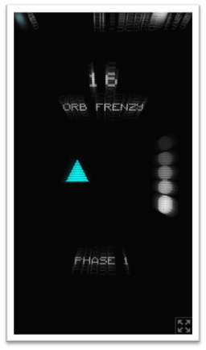   

**Valentine Mini Game** 
https://jiayuewu.itch.io/valentine2017 
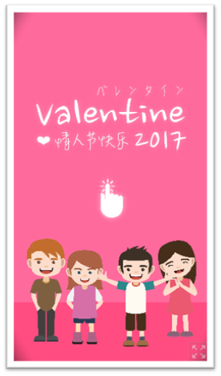 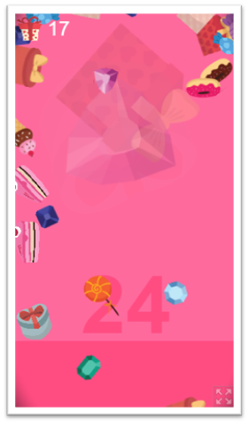    

**Tryo** 
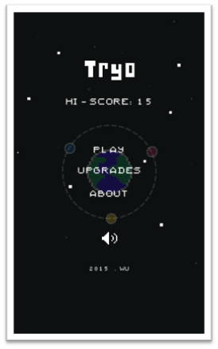 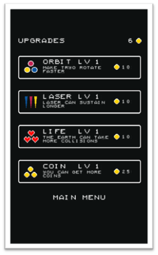 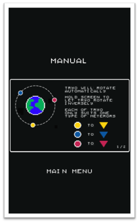 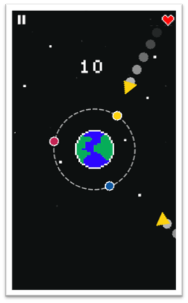
